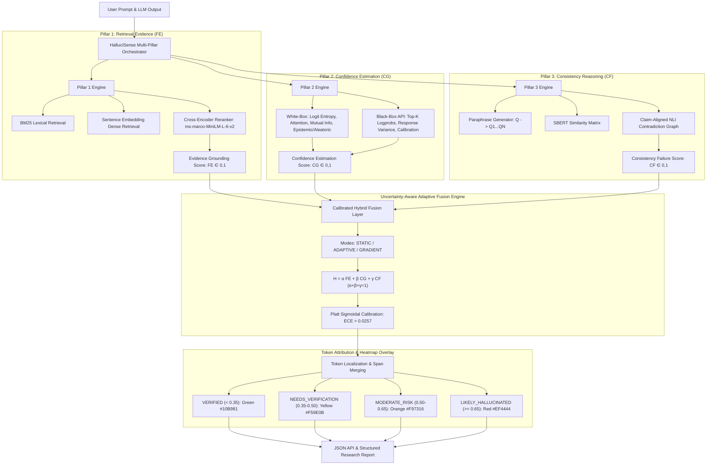

# HalluciSense Scientific System Architecture & Technical Design Specification (v2.0)

**Document Version**: 2.0.0-Publication-Ready  
**Target Platform**: Elsevier Research Framework / Enterprise Cloud  
**Authors**: Lead Research Engineer & Principal Scientist Team  

---

## 1. Complete Scientific Three-Pillar Architecture

---

## 2. Component Specifications

### A. Pillar 1: Retrieval Evidence ($FE \in [0,1]$)
- **Hybrid Retrieval**: BM25 sparse lexical matching combined with dense cosine embedding retrieval.
- **Reranking & Entailment**: Cross-Encoder passage reranking coupled with `nli-deberta-v3-small` entailment scoring.
- **Citation Confidence**: Calculates evidence support margin and citation reliability index.

### B. Pillar 2: Confidence Estimation ($CG \in [0,1]$)
- **White-Box Models**: Computes token logprobs, token entropy, attention entropy, predictive entropy $H(Y)$, mutual information $I(Y;W)$, epistemic uncertainty, and aleatoric uncertainty.
- **Black-Box API Models**: Approximates confidence via top-$k$ logprob differences, response variance across multi-queries, and Platt scaling calibration models.

### C. Pillar 3: Consistency Reasoning ($CF \in [0,1]$)
- **Paraphrase Sampling**: Generates $N$ semantic paraphrases ($Q_1, \dots, Q_N$) and queries target LLM.
- **SBERT Matrix**: Constructs full pairwise SBERT cosine similarity matrix $S_{ij}$.
- **Contradiction Graph**: Executes sentence-level NLI contradiction detection across response pairs.

### D. Fusion Layer & Explainability
- **Mathematical Model**: $H = \alpha FE + \beta CG + \gamma CF$ where $\alpha + \beta + \gamma = 1$.
- **Modes**: Supports `STATIC`, `ADAPTIVE`, and `GRADIENT`-learned weight optimization.
- **Diagnostics**: Computes weight importance vectors and 1D/2D parameter sensitivity analysis matrices.
- **Explainability Payload**: Every report includes evidence citations, confidence breakdown, consistency matrix, span localization, and 4-tier risk heatmaps (**Green**, **Yellow**, **Orange**, **Red**).
