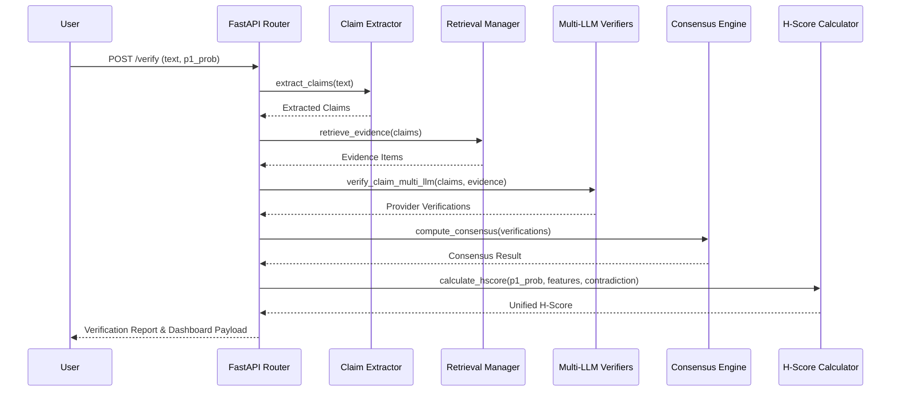

# HalluciSense Phase 10 — Sequence Diagrams

*Generated: 2026-08-03T05:01:37.151249+00:00*

```mermaid
sequenceDiagram
    participant User
    participant API as FastAPI Router
    participant Extractor as Claim Extractor
    participant Evidence as Retrieval Manager
    participant LLM as Multi-LLM Verifiers
    participant Consensus as Consensus Engine
    participant Score as H-Score Calculator

    User->>API: POST /verify (text, p1_prob)
    API->>Extractor: extract_claims(text)
    Extractor-->>API: Extracted Claims
    API->>Evidence: retrieve_evidence(claims)
    Evidence-->>API: Evidence Items
    API->>LLM: verify_claim_multi_llm(claims, evidence)
    LLM-->>API: Provider Verifications
    API->>Consensus: compute_consensus(verifications)
    Consensus-->>API: Consensus Result
    API->>Score: calculate_hscore(p1_prob, features, contradiction)
    Score-->>API: Unified H-Score
    API-->>User: Verification Report & Dashboard Payload
```
