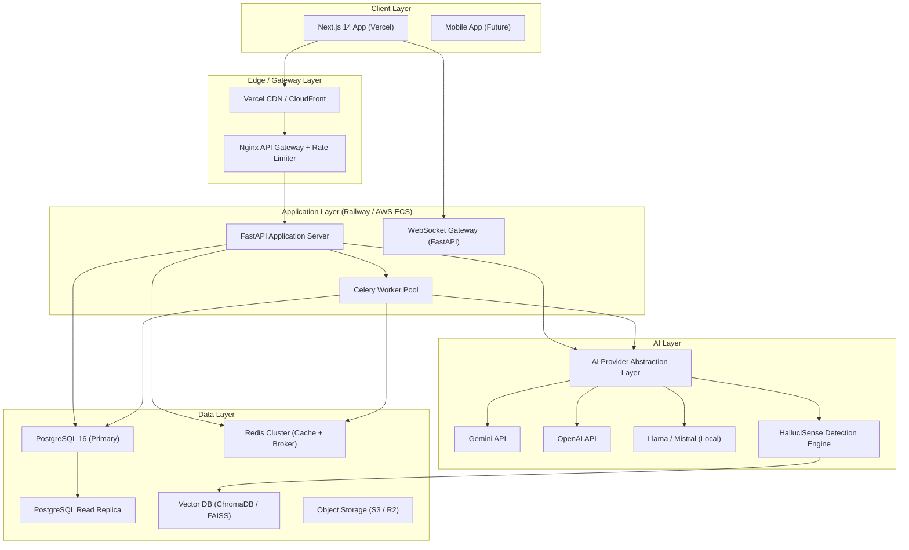
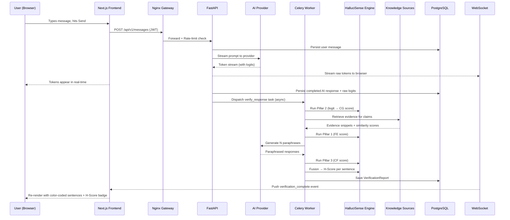

# HalluciSense — Sprint 0: System Architecture Blueprint

> **Role**: Principal Software Architect & AI Systems Architect
> **Scope**: Complete architectural specification before a single line of application code is written.

---

## 1. Project Vision & Constraints

HalluciSense is a production-grade, multi-tenant SaaS platform layered on top of any LLM (Gemini, OpenAI, Mistral, Llama). Its primary differentiator is a **tri-pillar hallucination detection engine** that intercepts every LLM response, analyzes it across three independent dimensions (factual grounding, generation confidence, semantic consistency), and returns enriched, color-coded, sentence-level annotations before the UI renders a single token.

### Non-Functional Requirements (Hard Constraints)
| Concern | Target |
|---|---|
| Latency (median) | ≤ 3s for response + analysis |
| Latency (p99) | ≤ 8s |
| Concurrent users | 10,000 on day-1 infra, 100,000 with horizontal scale |
| Auth security | JWT (HS256 access + RS256 refresh), PKCE OAuth |
| Data isolation | Row-Level Security (PostgreSQL RLS) per tenant/user |
| API availability | 99.9% uptime SLA |
| AI provider | Pluggable (no hard-coupling to any single provider) |

---

## 2. High-Level Architecture: System Context



---

## 3. Clean Architecture: Layer Definition

HalluciSense strictly follows Clean Architecture (Robert C. Martin). Dependency arrows point **inward only**.

```
┌─────────────────────────────────────────────────────────┐
│  Frameworks & Drivers (Outermost)                        │
│  FastAPI · Next.js · PostgreSQL · Redis · Celery         │
├─────────────────────────────────────────────────────────┤
│  Interface Adapters                                      │
│  API Routers · Schemas (Pydantic) · Repositories        │
│  Service Layer · WebSocket Handlers                      │
├─────────────────────────────────────────────────────────┤
│  Application Use Cases                                   │
│  SendMessage · AnalyzeResponse · GetHistory             │
│  ManageChat · ExportConversation · AdminMetrics         │
├─────────────────────────────────────────────────────────┤
│  Domain (Innermost — Zero Dependencies)                  │
│  Entities: User · Chat · Message · VerificationReport   │
│  Domain Services: HalluciSense Engine (Module 1)        │
│  Repository Interfaces (Abstract)                        │
└─────────────────────────────────────────────────────────┘
```

> **Critical Rule**: `app/core/engine/` (Module 1) lives in the **Domain Layer** and must NEVER import from FastAPI, SQLAlchemy, or any framework. It is a pure Python calculation engine.

---

## 4. Module Catalogue & Responsibilities

### Backend Modules

| Module | Package Path | Responsibility |
|---|---|---|
| **Authentication** | `app/modules/auth/` | JWT issuance/rotation, OAuth2, RBAC |
| **User Management** | `app/modules/users/` | Profile CRUD, preferences, quota |
| **Chat Management** | `app/modules/chat/` | Chat create/rename/delete/search/export |
| **Messaging** | `app/modules/messages/` | Message create, streaming, history |
| **AI Provider Abstraction** | `app/modules/providers/` | Pluggable LLM clients, load balancing |
| **Hallucination Engine** | `app/core/engine/` | The tri-pillar detection engine (Module 1) |
| **Verification Pipeline** | `app/modules/verification/` | Orchestrates engine, dispatches to Celery |
| **Knowledge Sources** | `app/modules/knowledge/` | BM25, FAISS, Wikipedia, custom KB |
| **Analytics** | `app/modules/analytics/` | User/system/hallucination metrics |
| **Admin Panel** | `app/modules/admin/` | Tenant management, system health, feature flags |
| **Export** | `app/modules/export/` | PDF, Markdown, JSON chat export |
| **Notifications** | `app/modules/notifications/` | WebSocket events, email alerts |

### Frontend Modules (Next.js Pages & Features)

| Module | Route | Responsibility |
|---|---|---|
| **Landing** | `/` | Marketing, feature showcase, CTA |
| **Authentication** | `/auth/login`, `/auth/signup` | JWT login, OAuth, magic links |
| **Dashboard** | `/dashboard` | Chat list, recent activity, quick stats |
| **Chat** | `/chat/[id]` | Full ChatGPT-like chat interface + inspector |
| **History** | `/history` | Searchable conversation archive |
| **Profile** | `/profile` | User settings, API keys, preferences |
| **Analytics** | `/analytics` | Personal hallucination metrics, charts |
| **Admin Panel** | `/admin` | System-wide metrics, user management |
| **Settings** | `/settings` | Model selection, theme, notification prefs |

---

## 5. Complete Folder Structure

### Backend (`c:\halusicense\backend`)

```
backend/
├── app/
│   ├── core/                          # Domain Layer (innermost)
│   │   ├── config.py                  # Settings (already built)
│   │   ├── security.py                # Password hashing, JWT utilities
│   │   ├── exceptions.py              # Domain exception classes
│   │   ├── constants.py               # Enum-like constants
│   │   └── engine/                    # HalluciSense Engine (Module 1 — DONE)
│   │       ├── types.py
│   │       ├── pillar1_retrieval.py
│   │       ├── pillar2_confidence.py
│   │       ├── pillar3_consistency.py
│   │       ├── fusion.py
│   │       └── pipeline.py
│   │
│   ├── database/                      # Database Infrastructure
│   │   ├── base.py                    # SQLAlchemy Base, engine creation
│   │   ├── session.py                 # Async session factory
│   │   └── migrations/                # Alembic migrations
│   │       └── versions/
│   │
│   ├── models/                        # SQLAlchemy ORM Models (Domain Entities)
│   │   ├── user.py                    # User entity
│   │   ├── chat.py                    # Chat entity
│   │   ├── message.py                 # Message entity
│   │   ├── verification_report.py     # Hallucination report entity
│   │   ├── evidence_item.py           # Evidence DB model
│   │   └── analytics_event.py         # Analytics event store
│   │
│   ├── repositories/                  # Repository Pattern (Interface Adapters)
│   │   ├── base.py                    # Generic async repository base
│   │   ├── user_repository.py
│   │   ├── chat_repository.py
│   │   ├── message_repository.py
│   │   └── verification_repository.py
│   │
│   ├── modules/                       # Application Layer (Use Cases)
│   │   ├── auth/
│   │   │   ├── router.py              # POST /auth/login, /register, /refresh, /logout
│   │   │   ├── schemas.py             # LoginRequest, TokenResponse, RegisterRequest
│   │   │   ├── service.py             # AuthService (use cases)
│   │   │   └── dependencies.py        # get_current_user, require_admin
│   │   │
│   │   ├── users/
│   │   │   ├── router.py              # GET/PUT /users/me
│   │   │   ├── schemas.py             # UserResponse, UserUpdateRequest
│   │   │   └── service.py             # UserService
│   │   │
│   │   ├── chat/
│   │   │   ├── router.py              # CRUD + search + export
│   │   │   ├── schemas.py             # ChatRequest, ChatResponse, ChatListResponse
│   │   │   └── service.py             # ChatService
│   │   │
│   │   ├── messages/
│   │   │   ├── router.py              # POST /messages, GET /messages/[chat_id], WebSocket
│   │   │   ├── schemas.py             # MessageRequest, MessageResponse, StreamChunk
│   │   │   └── service.py             # MessageService (coordinates LLM + Engine)
│   │   │
│   │   ├── providers/
│   │   │   ├── base.py                # AbstractLLMProvider (Protocol)
│   │   │   ├── gemini.py              # GeminiProvider implementation
│   │   │   ├── openai.py              # OpenAIProvider implementation
│   │   │   ├── ollama.py              # OllamaProvider (local Llama/Mistral)
│   │   │   ├── factory.py             # ProviderFactory (selects based on config)
│   │   │   └── schemas.py             # LLMRequest, LLMResponse, TokenLogit
│   │   │
│   │   ├── verification/
│   │   │   ├── router.py              # GET /verification/[message_id]
│   │   │   ├── schemas.py             # VerificationResponse, SentenceReport
│   │   │   ├── service.py             # VerificationService (bridges engine & DB)
│   │   │   └── tasks.py               # Celery async tasks
│   │   │
│   │   ├── knowledge/
│   │   │   ├── wikipedia.py           # WikipediaKnowledgeSource
│   │   │   ├── faiss_store.py         # FAISSVectorStore (sentence-transformer embeddings)
│   │   │   ├── bm25_retriever.py      # BM25Retriever
│   │   │   ├── cross_encoder.py       # CrossEncoder re-ranker
│   │   │   └── retriever.py           # HybridRetriever (BM25 + dense + rerank)
│   │   │
│   │   ├── analytics/
│   │   │   ├── router.py              # GET /analytics/me, /analytics/system
│   │   │   ├── schemas.py             # AnalyticsSummary, HScoreDistribution
│   │   │   └── service.py             # AnalyticsService
│   │   │
│   │   ├── admin/
│   │   │   ├── router.py              # Admin-only endpoints
│   │   │   ├── schemas.py
│   │   │   └── service.py
│   │   │
│   │   └── export/
│   │       ├── service.py             # ExportService (PDF, JSON, Markdown)
│   │       └── templates/             # Export templates
│   │
│   ├── workers/                       # Celery Worker Definitions
│   │   ├── celery_app.py              # Celery application config
│   │   └── tasks/
│   │       ├── verification_task.py   # Heavy analysis (Pillar 1, 2, 3 in parallel)
│   │       └── analytics_task.py      # Async analytics aggregation
│   │
│   └── main.py                        # FastAPI application factory
│
├── tests/
│   ├── unit/
│   │   ├── core/                      # Engine tests (Module 1 — DONE)
│   │   ├── modules/
│   │   └── repositories/
│   └── integration/
│       ├── api/
│       └── db/
│
├── alembic.ini
├── pytest.ini
├── requirements.txt
├── requirements-dev.txt
└── .env.example
```

### Frontend (`c:\halusicense\frontend`)

```
frontend/
├── src/
│   ├── app/                           # Next.js 14 App Router
│   │   ├── (auth)/
│   │   │   ├── login/page.tsx
│   │   │   └── signup/page.tsx
│   │   ├── (dashboard)/
│   │   │   ├── dashboard/page.tsx
│   │   │   ├── chat/
│   │   │   │   └── [id]/page.tsx      # Core chat experience
│   │   │   ├── history/page.tsx
│   │   │   ├── analytics/page.tsx
│   │   │   ├── profile/page.tsx
│   │   │   └── settings/page.tsx
│   │   ├── admin/
│   │   │   └── page.tsx
│   │   ├── layout.tsx                 # Root layout with providers
│   │   ├── page.tsx                   # Landing page
│   │   └── globals.css
│   │
│   ├── components/
│   │   ├── ui/                        # Shadcn UI primitives
│   │   ├── layout/
│   │   │   ├── Sidebar.tsx            # Chat history sidebar
│   │   │   ├── Header.tsx
│   │   │   └── MobileNav.tsx
│   │   ├── chat/
│   │   │   ├── ChatWindow.tsx         # Main chat viewport
│   │   │   ├── MessageBubble.tsx      # User / AI message with H-Score badge
│   │   │   ├── AnnotatedResponse.tsx  # Color-coded sentence renderer
│   │   │   ├── SentenceChip.tsx       # Clickable sentence with risk color
│   │   │   ├── TokenHighlight.tsx     # Token-level color overlay
│   │   │   ├── EvidenceModal.tsx      # Click-to-inspect sentence evidence panel
│   │   │   ├── HScoreBadge.tsx        # Animated H-Score indicator
│   │   │   ├── InputBar.tsx           # Message input with model selector
│   │   │   └── StreamingDots.tsx      # Loading animation
│   │   ├── verification/
│   │   │   ├── VerificationPanel.tsx  # Right-side inspection drawer
│   │   │   ├── PillarCard.tsx         # Individual pillar score card
│   │   │   ├── EvidenceCard.tsx       # Evidence snippet display
│   │   │   └── RiskGauge.tsx          # Animated gauge chart
│   │   ├── analytics/
│   │   │   ├── HScoreChart.tsx        # Time-series H-Score chart
│   │   │   ├── RiskDistribution.tsx   # Donut chart
│   │   │   └── TopicRiskMatrix.tsx    # Heatmap
│   │   └── shared/
│   │       ├── MarkdownRenderer.tsx
│   │       └── CodeBlock.tsx
│   │
│   ├── hooks/
│   │   ├── useChat.ts                 # Chat state management
│   │   ├── useWebSocket.ts            # Real-time streaming
│   │   ├── useVerification.ts         # Fetch verification reports
│   │   └── useAnalytics.ts
│   │
│   ├── stores/                        # Zustand state stores
│   │   ├── authStore.ts
│   │   ├── chatStore.ts
│   │   └── uiStore.ts
│   │
│   ├── services/                      # API client layer
│   │   ├── api.ts                     # Axios instance with interceptors
│   │   ├── authService.ts
│   │   ├── chatService.ts
│   │   ├── messageService.ts
│   │   └── verificationService.ts
│   │
│   ├── types/                         # TypeScript type definitions
│   │   ├── api.ts
│   │   ├── chat.ts
│   │   ├── verification.ts
│   │   └── analytics.ts
│   │
│   └── lib/
│       ├── utils.ts
│       ├── constants.ts
│       └── theme.ts
│
├── public/
├── next.config.ts
├── tailwind.config.ts
├── tsconfig.json
└── package.json
```

---

## 6. Complete Request Flow

### 6a. User Sends a Message (Happy Path)



### 6b. User Clicks a Sentence (Evidence Inspector)

```
Browser click → FE fetches GET /api/v1/verification/{message_id}/sentence/{sentence_id}
→ FastAPI queries PostgreSQL (VerificationReport, EvidenceItems)
→ Returns SentenceReport (evidence, similarity, reasoning, pillar scores)
→ Frontend renders EvidenceModal with source cards
```

---

## 7. Database Schema

### Entity Relationship Diagram

```mermaid
erDiagram
    USERS {
        uuid id PK
        string email UK
        string hashed_password
        string full_name
        string avatar_url
        enum role "USER|ADMIN"
        string preferred_model
        bool is_active
        bool is_verified
        timestamp created_at
        timestamp updated_at
    }

    CHATS {
        uuid id PK
        uuid user_id FK
        string title
        string model_used
        json metadata
        bool is_archived
        timestamp last_message_at
        timestamp created_at
    }

    MESSAGES {
        uuid id PK
        uuid chat_id FK
        uuid user_id FK
        enum role "USER|ASSISTANT|SYSTEM"
        text content
        json raw_logits
        float processing_time_ms
        enum verification_status "PENDING|PROCESSING|COMPLETE|FAILED"
        timestamp created_at
    }

    VERIFICATION_REPORTS {
        uuid id PK
        uuid message_id FK "1-to-1"
        float overall_h_score
        enum overall_risk "VERIFIED|NEEDS_VERIFICATION|LIKELY_HALLUCINATED"
        float factual_error_score
        float confidence_gap_score
        float consistency_failure_score
        json weights_used
        json pillar1_summary
        json pillar2_summary
        json pillar3_summary
        float processing_time_ms
        timestamp created_at
    }

    SENTENCE_ANALYSES {
        uuid id PK
        uuid report_id FK
        int sentence_index
        text sentence_text
        int start_char
        int end_char
        float h_score
        enum risk_level
        string color_code
        float factual_error
        float confidence_gap
        float consistency_failure
        text reasoning
        timestamp created_at
    }

    EVIDENCE_ITEMS {
        uuid id PK
        uuid sentence_id FK
        text claim
        text snippet
        string source_name
        string source_url
        float similarity_score
        bool is_supporting
        timestamp created_at
    }

    TOKEN_ANALYSES {
        uuid id PK
        uuid report_id FK
        int position
        string token
        float probability
        float entropy
        enum risk_level
        string color_code
    }

    ANALYTICS_EVENTS {
        uuid id PK
        uuid user_id FK
        string event_type
        json payload
        timestamp created_at
    }

    USERS ||--o{ CHATS : "owns"
    CHATS ||--o{ MESSAGES : "contains"
    USERS ||--o{ MESSAGES : "authors"
    MESSAGES ||--|| VERIFICATION_REPORTS : "has"
    VERIFICATION_REPORTS ||--o{ SENTENCE_ANALYSES : "breaks into"
    SENTENCE_ANALYSES ||--o{ EVIDENCE_ITEMS : "supported by"
    VERIFICATION_REPORTS ||--o{ TOKEN_ANALYSES : "has"
    USERS ||--o{ ANALYTICS_EVENTS : "generates"
```



### Key Design Decisions
- **UUIDs** everywhere for security and distributed compatibility.
- **JSON columns** for flexible pillar summaries without over-normalization.
- **PostgreSQL RLS** enforces user isolation at DB level.
- **Token analyses** stored for replay/debugging, archived to S3 after 30 days.

---

## 8. Module Interaction & Dependency Map

```
┌────────────────────────────────────────────────────────────────────┐
│                         FastAPI (main.py)                          │
│                Registers all routers, middleware, events           │
└────────────────────────────────────────────────────────────────────┘
         │               │              │             │
    [auth]          [chat]        [messages]    [verification]
         │               │              │             │
         └───────────────┴──────────────┴─────────────┘
                              │
                     [repositories]
                              │
                     [database/session]
                              │
                       [PostgreSQL]

[messages] ──────────► [providers/factory] ──► Gemini | OpenAI | Ollama
    │
    └──────────────► [workers/verification_task] (async via Celery)
                              │
              ┌───────────────┼───────────────┐
         [Pillar 1]      [Pillar 2]       [Pillar 3]
              │               │               │
         [knowledge]     [core/engine]   [providers]
         (BM25+FAISS)    (pure Python)   (paraphrases)
              └───────────────┼───────────────┘
                              │
                      [core/engine/fusion]
                              │
                    [VerificationReport saved to PG]
                              │
                   [WebSocket notification → FE]
```

---

## 9. Authentication & Security Architecture

```
┌────────────────────────────────────────────────────────────┐
│                   Authentication Flow                       │
├────────────────────────────────────────────────────────────┤
│ 1. POST /auth/register                                      │
│    → Argon2 password hash → DB insert → Email verification │
│                                                            │
│ 2. POST /auth/login                                        │
│    → Verify password → Issue:                              │
│    access_token  (HS256, 15-min TTL, in-memory/cookie)     │
│    refresh_token (RS256, 7-day TTL, httpOnly secure cookie)│
│                                                            │
│ 3. Every Request                                           │
│    → Bearer token → decode → user_id → fetch user from    │
│      Redis cache (hit) or PostgreSQL (miss, then cache)    │
│                                                            │
│ 4. Token Refresh                                           │
│    → POST /auth/refresh → validate refresh → new pair      │
│    → Old refresh token blacklisted in Redis (bloom filter) │
│                                                            │
│ 5. OAuth2 (Google / GitHub)                                │
│    → PKCE flow → verify ID token → upsert user → JWT pair │
│                                                            │
│ 6. RBAC                                                    │
│    → Role field on user: USER | ADMIN                      │
│    → require_admin dependency on admin router              │
└────────────────────────────────────────────────────────────┘
```

### Security Hardening Checklist
- Input validation via Pydantic v2 (strict mode).
- SQL injection prevention via SQLAlchemy ORM (no raw SQL).
- Rate limiting: 100 req/min per user, 20 req/min on auth endpoints.
- CORS restricted to frontend domain only.
- Secrets via environment variables, never committed.
- PostgreSQL Row-Level Security for multi-tenant data isolation.
- Redis token blacklist for logout invalidation.

---

## 10. AI Provider Abstraction Layer

```
AbstractLLMProvider (Protocol)
├── generate(prompt, params) → LLMResponse
├── stream(prompt, params) → AsyncGenerator[StreamChunk]
├── get_logits(prompt, params) → List[TokenLogit]
└── generate_n(prompt, n, params) → List[LLMResponse]

Implementations:
├── GeminiProvider       → google-generativeai SDK
├── OpenAIProvider       → openai SDK
└── OllamaProvider       → httpx to local Ollama

ProviderFactory.create(provider_name: str) → AbstractLLMProvider
  • Reads from user settings OR environment LLMCONFIG
  • Allows per-request model override
```

---

## 11. Hallucination Engine Integration Points

Module 1 (Core Engine) already built. Here is where it integrates:

```
verification/tasks.py (Celery)
    │
    ├── Step 1: Load message + raw_logits from DB
    │
    ├── Step 2 (Pillar 2): pillar2_confidence.analyze(tokens, logits)
    │           [IMMEDIATE — logits already captured during streaming]
    │
    ├── Step 3 (Pillar 1): knowledge.retriever.retrieve(claims)
    │           → Wikipedia API + FAISS dense + BM25 sparse
    │           → Cross-Encoder re-ranking
    │           → pillar1_retrieval.analyze(text, evidence_items)
    │
    ├── Step 4 (Pillar 3): providers.generate_n(prompt, n=3)
    │           → sentence-transformers cosine similarity
    │           → pillar3_consistency.analyze(primary, samples)
    │
    └── Step 5 (Fusion): pipeline.analyze_response(...)
                → Save HallucinationReport to PostgreSQL
                → Emit WebSocket event
```

**The engine never touches I/O — it is called BY the service layer, not the other way around.** This maintains Clean Architecture purity.

---

## 12. Caching Strategy

| Data | Cache Location | TTL | Invalidation |
|---|---|---|---|
| JWT user session | Redis | 15 min | On logout |
| Chat list per user | Redis | 5 min | On new/delete chat |
| Verification report | Redis | 60 min | Never (immutable) |
| LLM response (exact prompt) | Redis | 24 hrs | Manual flush |
| Analytics aggregates | Redis | 10 min | On new event |
| FAISS index | In-memory (worker) | Process lifetime | Rebuild on update |

---

## 13. Sprint Roadmap

### Sprint 1 — Backend Foundation & Auth (Week 1)
**Goal**: Running FastAPI with authenticated endpoints and full DB schema.
- [ ] FastAPI application factory with middleware (CORS, logging, rate-limiting)
- [ ] Database session, SQLAlchemy async engine, Alembic init
- [ ] All ORM models (User, Chat, Message, VerificationReport, SentenceAnalysis, EvidenceItem)
- [ ] First Alembic migration (initial schema)
- [ ] Auth module: register, login, refresh, logout with JWT
- [ ] Users module: GET/PUT /users/me
- [ ] Repository pattern implementation (base + user)
- [ ] Integration tests for auth endpoints
- [ ] Docker Compose: PostgreSQL + Redis + API server
- **Deliverable**: `curl /auth/register && curl /auth/login` returns JWT

### Sprint 2 — Chat & Message Core (Week 2)
**Goal**: Users can create chats, send messages, and receive basic LLM responses.
- [ ] Chat CRUD (create, list, rename, delete, search)
- [ ] Chat repository
- [ ] AI Provider Abstraction Layer (AbstractLLMProvider)
- [ ] GeminiProvider implementation with streaming
- [ ] Message endpoint (POST /messages, WebSocket streaming)
- [ ] Stream raw LLM tokens to frontend via WebSocket
- [ ] Persist completed messages and captured logits
- [ ] Message history endpoint
- **Deliverable**: Full chat conversation with any LLM provider

### Sprint 3 — Hallucination Verification Pipeline (Week 3)
**Goal**: Every AI response is analyzed and a full HallucinationReport is stored.
- [ ] Celery app + Redis broker configuration
- [ ] Knowledge sources: Wikipedia adapter, BM25 retriever
- [ ] FAISS vector store + sentence-transformer indexing
- [ ] CrossEncoder re-ranker
- [ ] HybridRetriever (BM25 + dense + rerank)
- [ ] VerificationService (bridges engine + DB)
- [ ] `verify_response` Celery task (orchestrates all 3 pillars)
- [ ] WebSocket notification on verification complete
- [ ] Verification report API endpoints
- **Deliverable**: Every AI response gets a stored HallucinationReport in DB

### Sprint 4 — Frontend Core: Auth + Chat UI (Week 4)
**Goal**: Beautiful, production-quality ChatGPT-like UI.
- [ ] Next.js 14 project setup (App Router, TypeScript, Tailwind, Shadcn)
- [ ] Landing page (animated, glassmorphism, dark theme)
- [ ] Auth pages: Login + Signup with form validation
- [ ] Zustand auth store + Axios interceptors
- [ ] Sidebar with chat history + search
- [ ] Chat window: message rendering, streaming, Markdown support, code highlighting
- [ ] Framer Motion page transitions and micro-animations
- **Deliverable**: User can login, create a chat, and have an AI conversation

### Sprint 5 — Frontend: Hallucination Inspector UI (Week 5)
**Goal**: The unique HalluciSense UI layer — color-coded responses + evidence inspector.
- [ ] AnnotatedResponse component (sentence-by-sentence color coding)
- [ ] H-Score badge with animated gauge
- [ ] SentenceChip (clickable Green/Yellow/Red chips)
- [ ] EvidenceModal with full evidence card layout
- [ ] TokenHighlight component (word-level color overlay)
- [ ] VerificationPanel (right-side drawer with pillar breakdown)
- [ ] PillarCard components (FE, CG, CF individual displays)
- [ ] Progressive loading: stream first, annotate after verification completes
- **Deliverable**: Full hallucination analysis visible in the UI

### Sprint 6 — Analytics, Export & Profile (Week 6)
- [ ] Analytics module (backend + frontend charts)
- [ ] Export service (PDF, Markdown, JSON)
- [ ] Profile & settings pages
- [ ] Admin panel (user management, system health)
- [ ] Chat rename, delete, archive, pin
- **Deliverable**: Complete secondary feature set

### Sprint 7 — OpenAI, Ollama & Multi-Model Support (Week 7)
- [ ] OpenAIProvider implementation
- [ ] OllamaProvider (local Llama 3 / Mistral)
- [ ] Model selector in UI input bar
- [ ] Per-model logit capture adapters
- [ ] Provider health checks and fallback routing

### Sprint 8 — Hardening, Testing & Production Deploy (Week 8)
- [ ] Full test suite (unit + integration + E2E with Playwright)
- [ ] Docker production build + Nginx config
- [ ] GitHub Actions CI/CD pipeline
- [ ] Vercel deployment (frontend) + Railway deployment (backend)
- [ ] Performance profiling + Redis caching tuning
- [ ] Security audit: rate limiting, RLS, OWASP headers
- [ ] API documentation (auto-generated OpenAPI + ReDoc)
- **Deliverable**: Live production URL

---

## 14. Scalability, Security & Performance Concerns

### Scalability
| Concern | Risk | Mitigation |
|---|---|---|
| Verification latency blocks UX | HIGH | Async Celery; stream tokens first, annotate after |
| Single DB write bottleneck | MEDIUM | Write to queue, batch-insert analytics events |
| FAISS index memory per worker | MEDIUM | Shared index on disk, lazy load per worker |
| LLM API rate limits | HIGH | Per-provider rate limiter + exponential backoff + fallback |
| WebSocket connection count | MEDIUM | Redis pub/sub for multi-instance WS broadcasting |

### Security
| Concern | Risk | Mitigation |
|---|---|---|
| JWT token theft | HIGH | httpOnly cookies for refresh token, short access token TTL |
| Prompt injection via user input | HIGH | Sanitize before sending to LLM, system prompt hardening |
| SSRF via custom knowledge sources | MEDIUM | URL allowlist for external evidence fetching |
| LLM response injection | MEDIUM | Strip control characters before DB storage |
| Multi-tenant data leak | CRITICAL | PostgreSQL RLS + repository-level user_id filtering |

### Performance
| Concern | Risk | Mitigation |
|---|---|---|
| Pillar 1 (Wikipedia) is slow | HIGH | Cache Wikipedia responses per claim in Redis (24h) |
| sentence-transformer inference | HIGH | Batch inference, GPU if available, quantized model |
| N-sample paraphrase generation (Pillar 3) | MEDIUM | N=3 default, configurable per user plan tier |
| Large chat history queries | MEDIUM | Cursor-based pagination, DB indexes on (user_id, created_at) |

---

## 15. Architectural Recommendations

> [!IMPORTANT]
> **Recommendation 1: Adopt Event-Driven Verification**
> Rather than synchronous verification, use Celery + Redis pub/sub. The user sees AI response immediately (fast), verification arrives asynchronously (~2–5s). This is the Perplexity AI model and is critical for UX.

> [!TIP]
> **Recommendation 2: Pillar Parallelism**
> Run Pillar 1, Pillar 2, and Pillar 3 in parallel using `asyncio.gather` or Celery group chords. Only Pillar 2 depends on logits (available immediately); Pillars 1 and 3 can start concurrently.

> [!NOTE]
> **Recommendation 3: Two-Phase Rendering**
> Phase 1: Stream raw Markdown to the user as it arrives.
> Phase 2: Replace rendered HTML with color-coded AnnotatedResponse once verification arrives. Framer Motion handles the swap animation.

> [!TIP]
> **Recommendation 4: H-Score Caching**
> Since identical prompts + model produce deterministic responses, cache (hash(prompt + model)) → VerificationReport in Redis. Skip re-analysis for duplicate queries — massive cost savings.

> [!IMPORTANT]
> **Recommendation 5: Modular Pillar Plugin System**
> Design `AbstractKnowledgeSource` so teams can plug in custom knowledge bases (internal Confluence, Notion, Slack) per workspace — critical for enterprise monetization.

> [!NOTE]
> **Recommendation 6: Logit Capture Strategy**
> Gemini API does not expose per-token logprobs via standard streaming. Use `response.candidates[].content.parts[].text` with `generation_config.logprobs=True` (beta). For OpenAI use `logprobs=True`. For Ollama use `/api/generate` with `logprobs: true`. Pillar 2 degrades gracefully to entropy estimation if logprobs unavailable.

---

## 16. Technology Decisions Finalized

| Decision | Choice | Reason |
|---|---|---|
| Frontend framework | Next.js 14 (App Router) | SSR + RSC + streaming support |
| State management | Zustand + React Query | Lightweight, no Redux boilerplate |
| UI component library | Shadcn/UI | Unstyled, fully ownable, beautiful defaults |
| Animation | Framer Motion | Production-grade, declarative |
| Backend framework | FastAPI | Async-native, auto OpenAPI, Pydantic v2 |
| ORM | SQLAlchemy 2.0 async | Industry standard, type-safe |
| Task queue | Celery + Redis | Proven at scale, flexible |
| Vector DB | ChromaDB (dev) → FAISS (prod) | ChromaDB for easy local dev, FAISS for perf |
| Embedding model | `all-MiniLM-L6-v2` | Small, fast, excellent quality |
| Cross-encoder | `cross-encoder/ms-marco-MiniLM-L-6-v2` | Best quality/speed tradeoff |
| Auth | JWT HS256 + RS256 | Industry standard, stateless |
| Deployment | Vercel (FE) + Railway (BE) | Zero DevOps to start, scale later to AWS |
